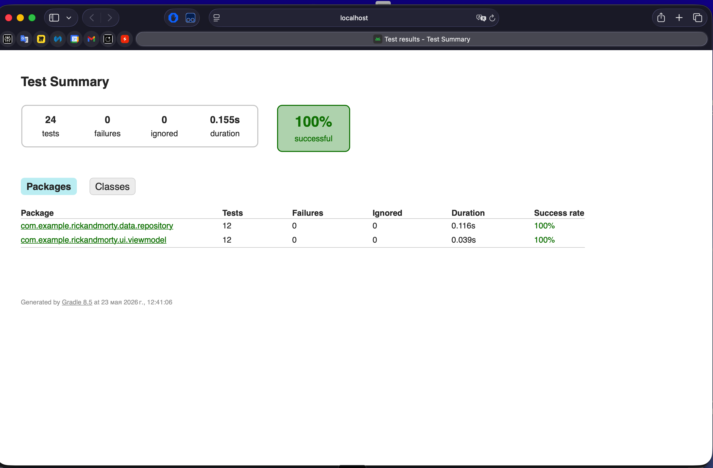
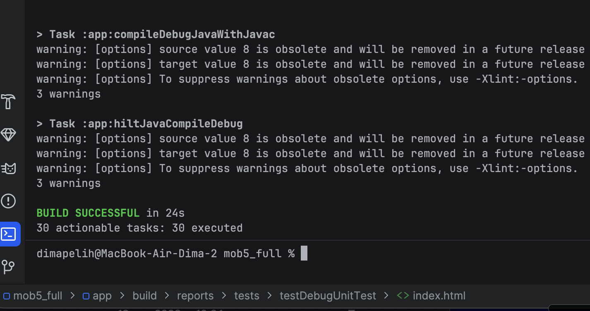
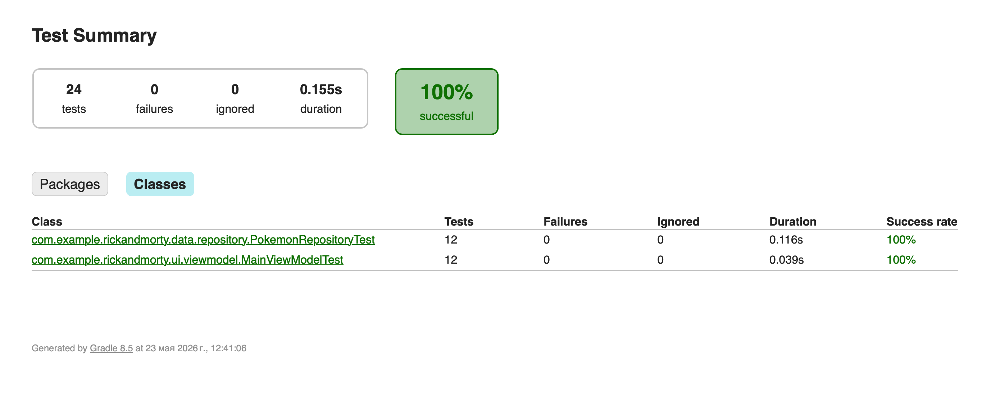
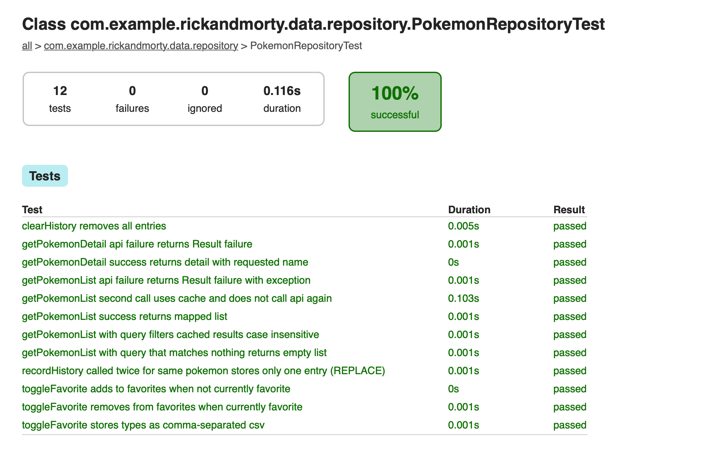

ФИО: Пелих Дмитрий Александрович
Группа: Б9123-09.03.03

Выбранный API:
PokeAPI (https://pokeapi.co/). Тот же проект, что в ДЗ №4 — список покемонов, детали, избранное и история через Room, DI через Hilt.

Что сделано в ДЗ №5:

+ Покрыт тестами data-слой и ViewModel — 24 unit-теста (src/test) и 12 инструментальных (src/androidTest).
+ Unit-тесты: PokemonRepositoryTest (кэширование, debounce поиска, сетевые ошибки), MainViewModelTest (состояния List и Detail, реакция на смену query и favorites).
+ Инструментальные: RoomIntegrationTest (FavoritesDao/HistoryDao на in-memory Room), RepositoryRoomIntegrationTest (Repository поверх in-memory БД), PokemonListScreenTest (Compose UI Test через createComposeRule).
+ Fake-реализации PokeApi и DAO в src/test и src/androidTest — не зависим от сети и реальной БД.

Чеклист требований ТЗ:

+ Юнит-тесты для бизнес-логики (Repository + ViewModel) с использованием kotlinx-coroutines-test (runTest, StandardTestDispatcher, MainDispatcherRule).
+ Тесты Flow / StateFlow через Turbine.
+ Инструментальные тесты Room на in-memory builder.
+ Compose UI-тесты через createComposeRule.
+ Базовый проект из ДЗ №4 рабочий, никакой production-код не сломан.

Стек тестирования:

JUnit 4, kotlinx-coroutines-test, Turbine, Room in-memory builder, Compose UI Test (createComposeRule), Fake DAO/Api.

Как запустить:

Юнит-тесты: `./gradlew :app:testDebugUnitTest`
Инструментальные (нужен эмулятор/устройство): `./gradlew :app:connectedDebugAndroidTest`
Отчёты: app/build/reports/tests/testDebugUnitTest/index.html и app/build/reports/androidTests/connected/index.html

Скриншоты:

Сводка по unit-тестам — 24 теста, 0 failures, 100% successful:

Терминал — BUILD SUCCESSFUL:

Тесты по классам — PokemonRepositoryTest (12) + MainViewModelTest (12):

PokemonRepositoryTest — 12 тестов passed:

