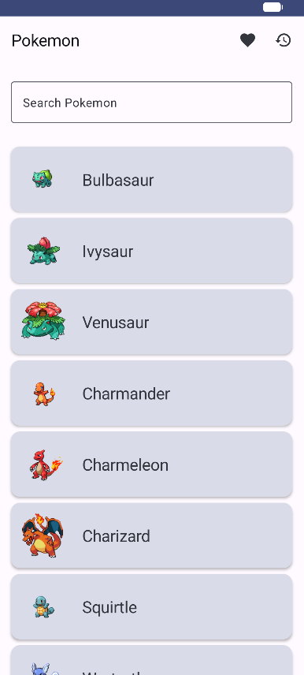
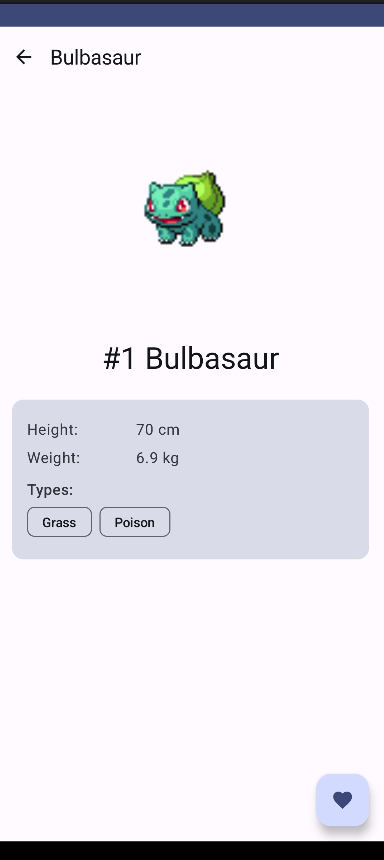
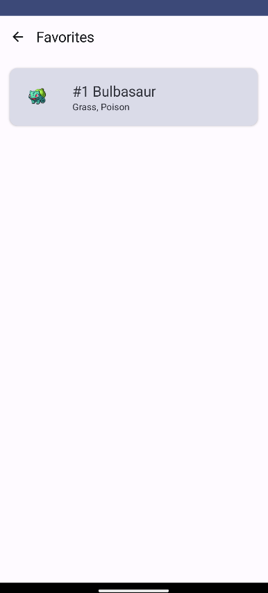
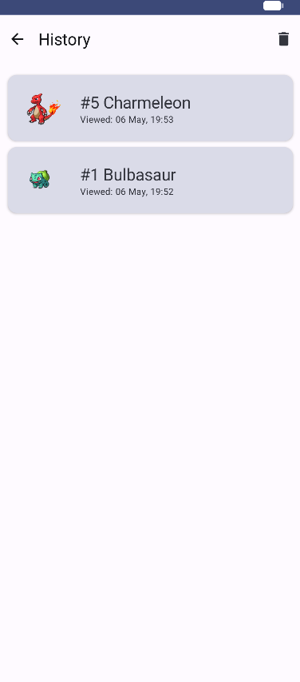
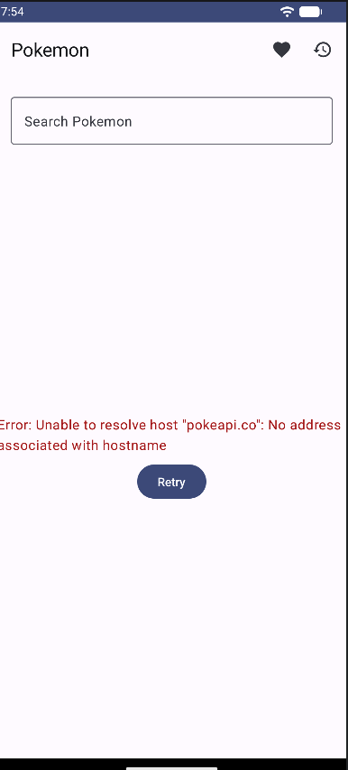

ФИО: Пелих Дмитрий Александрович
Группа: Б9123-09.03.03

Выбранный API:
PokeAPI (https://pokeapi.co/)
Открытый API, предоставляющий информацию о покемонах.
В приложении используется для получения списка персонажей, их изображений (спрайтов) и детальной информации (рост, вес, типы).
API полностью бесплатный и не требует API-ключа для использования.

Что хранится в Room:

База данных pokemon.db, версия 1, две таблицы.

favorites — избранные покемоны. Запись добавляется при нажатии на сердечко на экране Detail и удаляется при повторном нажатии. Поля: id (PK), name, imageUrl, types (csv), addedAt (millis). После полного перезапуска приложения избранное остаётся.

history — история просмотров. При каждом успешном открытии экрана Detail запись пишется в таблицу через REPLACE по id (обновляется только время последнего просмотра). На экране History список выводится в обратном порядке по времени, есть кнопка очистки.

Как проверить (сделал — перезапустил — осталось):

1. Дождаться загрузки списка, открыть любого покемона.
2. Нажать сердечко на экране Detail (станет красным).
3. Вернуться, открыть Favorites — он там.
4. Полностью закрыть приложение (свайпнуть из недавних или adb shell am force-stop com.example.rickandmorty).
5. Запустить заново. В Favorites запись на месте, в History тоже.

Чеклист выполненных требований:

Обязательный функционал:
+ Hilt: DI подключён через @HiltAndroidApp на Application, @AndroidEntryPoint на MainActivity, @HiltViewModel на ViewModel. Зависимости (Retrofit, Repository, AppDatabase, DAO) раздаются модулями NetworkModule и DatabaseModule с @InstallIn(SingletonComponent::class). В UI и ViewModel нет ни одного new или object для создания зависимостей.
+ Room: 2 таблицы (favorites и history), реально используются — favorites переживает перезапуск, history пишется при каждом открытии Detail.
+ Приложение из ДЗ №3 остаётся рабочим: 4 экрана через Navigation Compose (List, Detail, Favorites, History), Retrofit + coroutines + viewModelScope, UI состояния Loading / Error+Retry / Empty / Success на List и Loading / Error+Retry / Success на Detail.

Технические требования:
+ Hilt 2.50
+ Room 2.6.1 (Entity + DAO + Database, наблюдение через Flow)
+ Jetpack Compose + Material3
+ Navigation Compose 2.7.6 (parent-graph scoping для общего ViewModel)
+ ViewModel + viewModelScope + StateFlow + collectAsStateWithLifecycle
+ Retrofit + Gson Converter + OkHttp logging
+ Coil 2.5.0 для картинок
+ Kotlin 1.9.20, AGP 8.2.0, KSP, compileSdk 34, minSdk 24

Бонусы:
+ Реализованы оба сценария Room сразу — и Favourites, и History, плюс отдельные экраны под каждый.
+ Debounce поиска 500мс через Job и delay.
+ Подключен HttpLoggingInterceptor для отладки сетевых запросов.
+ Использована библиотека Coil для асинхронной загрузки спрайтов.
+ Один общий ViewModel на весь NavGraph через hiltViewModel(parentBackStackEntry) — состояние не теряется между переходами.

Скринщоты:

01_loading.png — Loading при старте
02_list.png — список покемонов (Success)
03_detail.png — Detail с залитым сердечком
04_favorites.png — Favorites из Room
05_history.png — History из Room
06_error.png — Error + Retry (без интернета)

